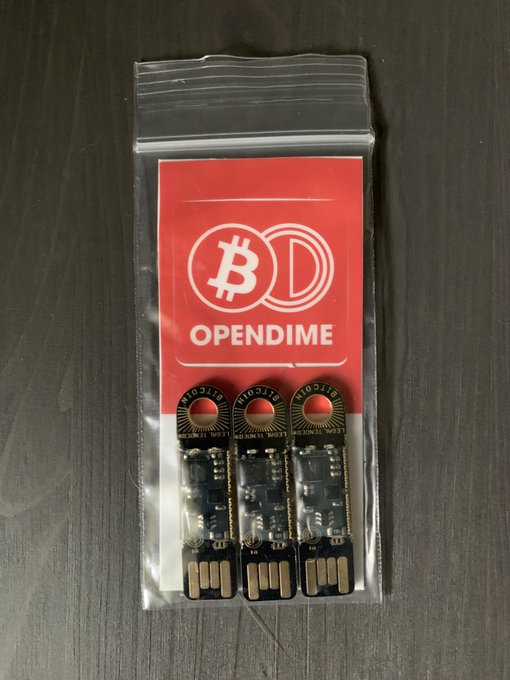
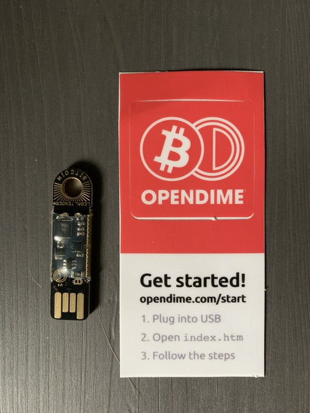

# Introduction to the OpenDime
The first #Bitcoin bearer instrument, designed to securely & discreetly circulate sats in a handy USB stick.

https://opendime.com/

The [@OPENDIME](https://twitter.com/OPENDIME) is small, easy to conceal, and easy to transport. They measure 1/2" x 1-7/8" & can easily be kept on a key chain, a necklace, or somewhere more safe.

@OPENDIME comes in packs of three, which is convenient for keeping sats spread out between different devices. They come with a cool sticker and simple instructions.

