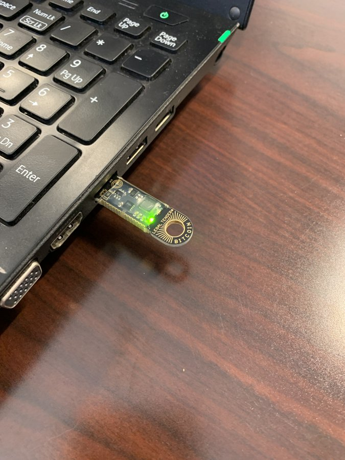
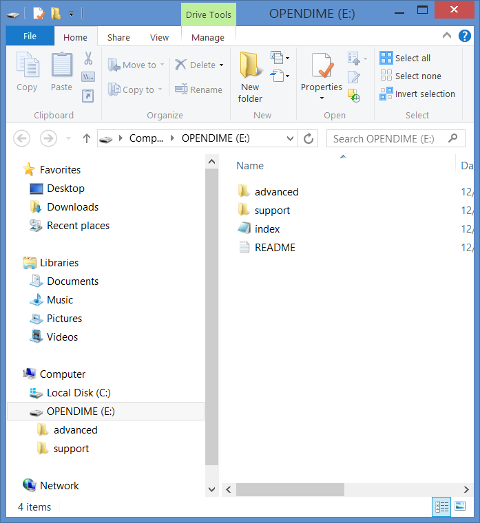
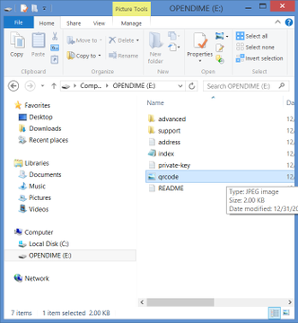

# Getting Started
Once you plug in your @OPENDIME it will light up with a stationary green light and a flashing red light. They plug into any laptop, computer, or phone USB socket. They act like a read-only USB flash drive.

Simply drag & drop a random file of yours into the root of the @OPENDIME. You need at least 256k bytes which the device will use as entropy to create your private key. You have a little more than 1 MB of room, so files that are too large won't work. README.txt has resources.

The @OPENDIME may eject itself & then reconnect after it has written the private key. Now you have a QR Code.jpg file & address.txt file that you can send sats to. The red light should no longer flash.

