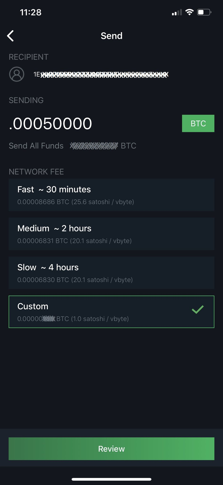

# Depositing Bitcoin
Now you can use your favorite mobile wallet to scan the QR code & load some sats on your @OPENDIME. Or you can copy/paste the address which is saved to a .txt file. In this example, I used my Greenwallet to deposit 50,000 sats.

Let's review what we've done so far: Loaded random bytes, generated private key & corresponding address, then deposited some BTC. The private key never leaves the @OPENDIME, we have essentially secured 50k sats on a small device that can be easily & discreetly transferred.

That's pretty powerful when you think about it. Swap @OPENDIME with your friends to "coinjoin", pay someone like you would with cash, transport life-changing amounts of BTC undetected across borders. The world is your oyster.

You can use a block explorer to easily check the address of your @OPENDIME. Be aware of the privacy considerations when using these tools though. Or plug into any device with a wallet capable of sweeping keys to transfer to that wallet. In the mean time, stash your sats.

