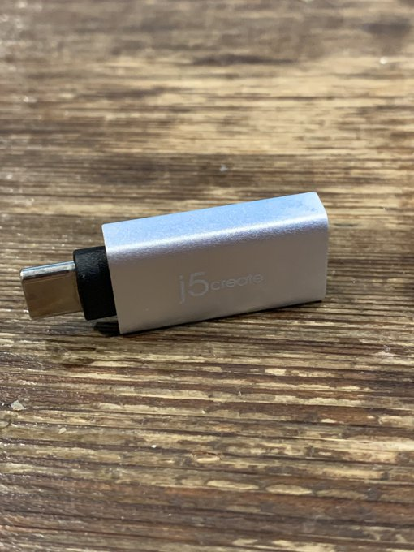
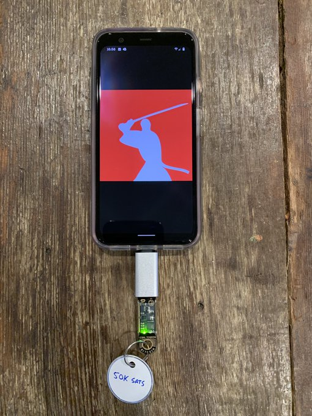
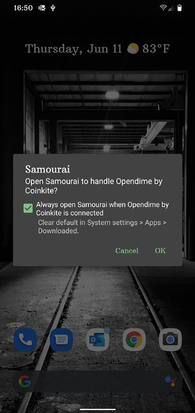
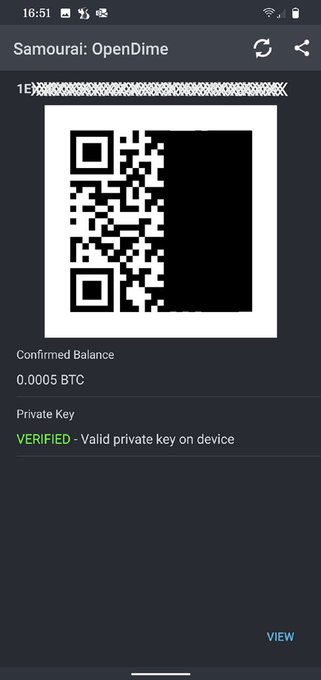
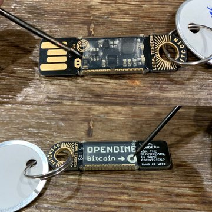
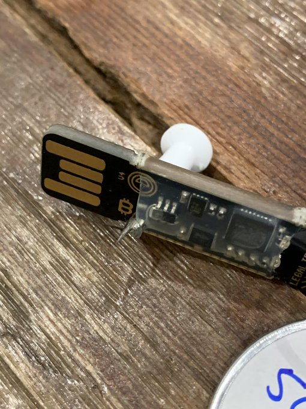
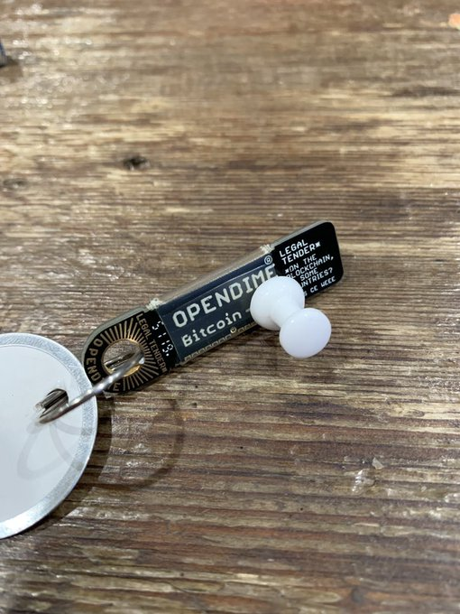
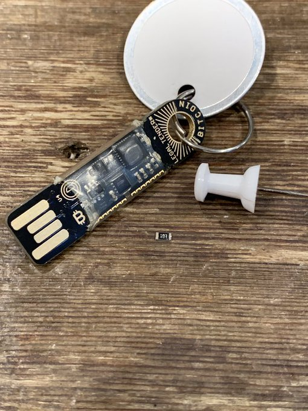
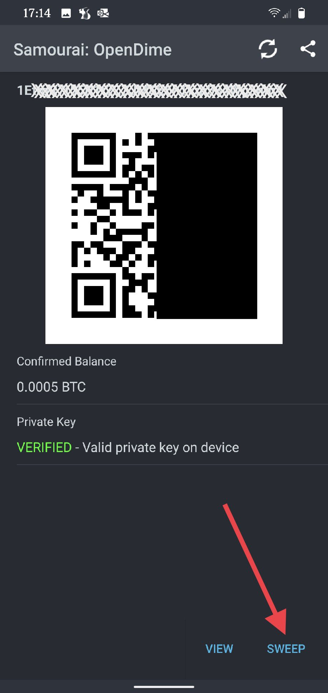

# How to sweep bitcoin to a new wallet
Now that I have a USB-C OTG adaptor, I can demonstrate how to sweep an [@OPENDIME](https://twitter.com/OPENDIME) into [@SamouraiWallet](https://twitter.com/SamouraiWallet).

[@BitcoinQ_A](https://twitter.com/BitcoinQ_A) did a thorough & detailed  explanation of this process [here](https://twitter.com/BitcoinQ_A/status/1271123885711384579).

To check the balance & verify the private key is still intact, plug the adaptor & @OPENDIME

into the Android. A prompt will ask if you want @SamouraiWallet to handle these devices by default. Then the balance, address text, QR code, & a link to view on OXT are shown.

Now for the fun part! In order for the private key to be exposed so @SamouraiWallet can read it, a small chip needs to be removed from the @OPENDIME. Poke a hole through the device & pry the chip off the board, this is called unsealing.

When the @OPENDIME is plugged back into the Android, @SamouraiWallet will give you the option to sweep the private key. This works because the OpenDimes are implementing the Wallet Import Format (WIF) Bitcoin wallet format. This is a decent explainer article on WIF:

https://allprivatekeys.com/what-is-wif 

Basically, there is one address and one private key. You can send bitcoin to the address as much as you want and the funds are safe so long as you have possession of your OpenDime. The only way the private key will be exposed is by removing that little microchip as explained above. Once that chip is removed, it alters the code on the OpenDime and writes the Private key file allowing it to be read by wallets with sweep capabilities like Samourai Wallet. Once the funds are swept to another wallet you may as well turn the OpenDime into a keychain or throw it away or something. It will still function, you can still send funds to that same address, you can still sweep them, but the private key has been exposed and anyone could plug your OpenDime into a computer and grab that private key instantly and sweep your funds. So once you use your OpenDime, don't re-use it, it's not safe.

You'll notice that the lights on the @OPENDIME flash in a syncopated fashion, giving the user a clear visual indication that the private key has been unsealed.

@SamouraiWallet asks for a confirmation then the tx is broadcast across the Bitcoin network. Overall that was easy & intuitive! Check the tx on OXT. Join a whirlpool. Use a Dojo ;)

Thanks for reading! I hope you enjoyed this article and see some utility in using an OpenDime for some of your Bitcoin needs. Opendimes are a great way to privately transact in Bitcoin like cash, the funds are secure, nobody knows the private key until the microchip is removed, and exchanging an OpenDime with someone doesn't leave any transaction on the blockchain. 
