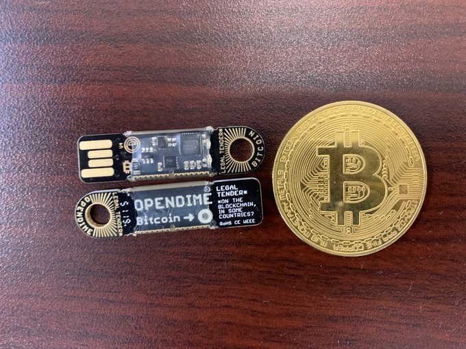

# OpenDime Features and How to Use One.
OpenDimes are a Bitcoin wallet in a USB stick. They are designed to be used once and physically transfer bitcoin. This article describes some of the OpenDimes coolest features, how they work, and examples of using one. 

  

